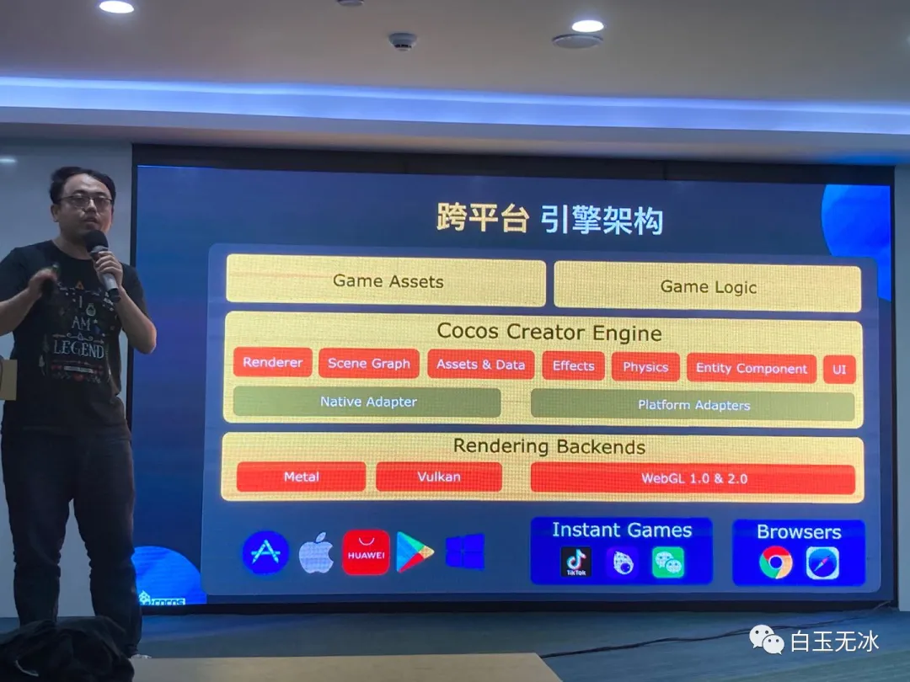
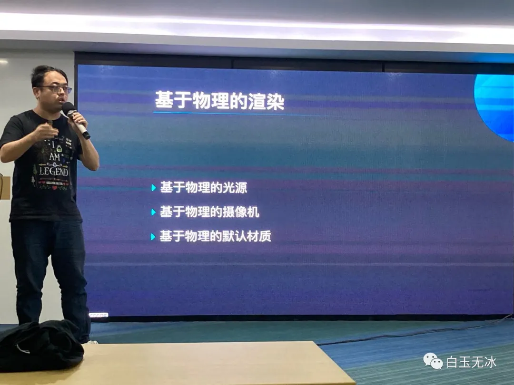
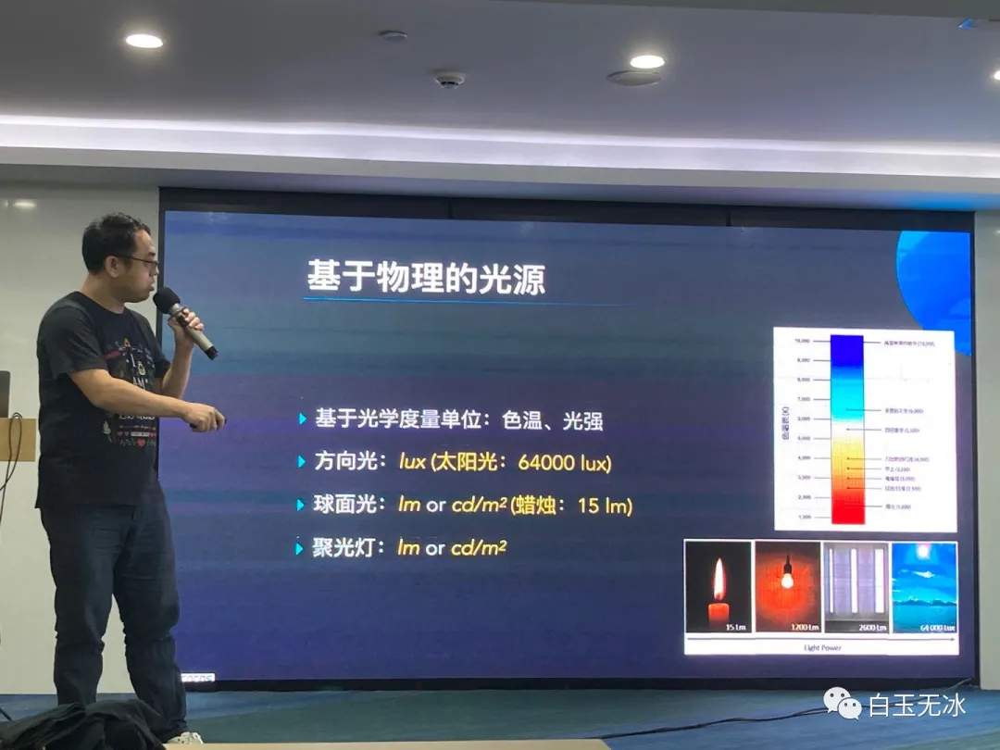
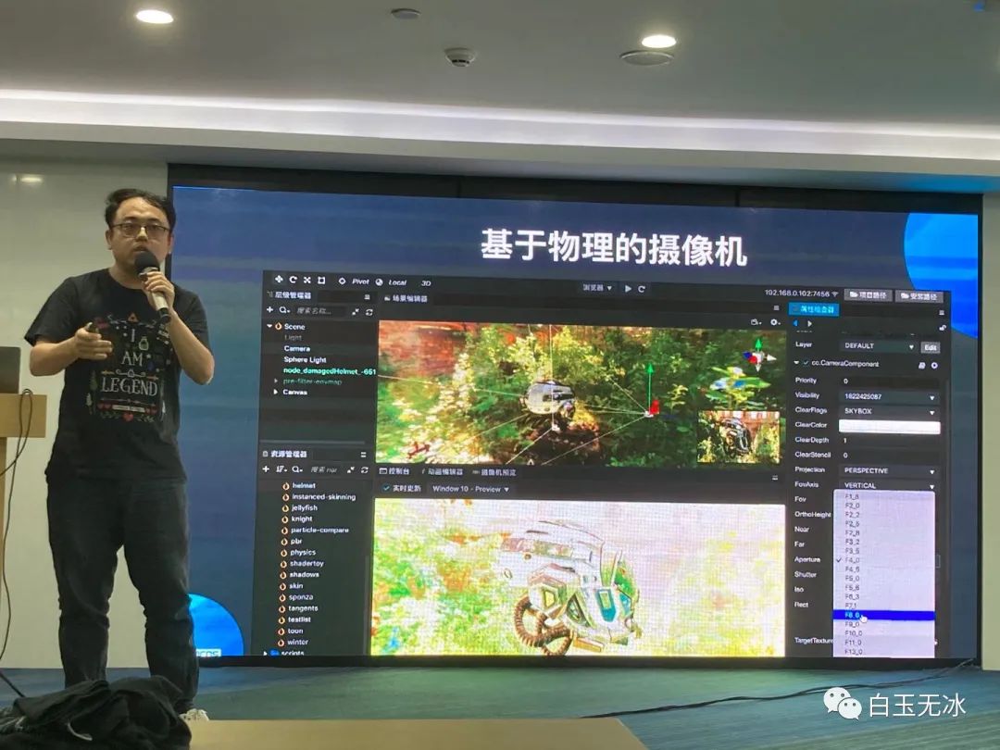
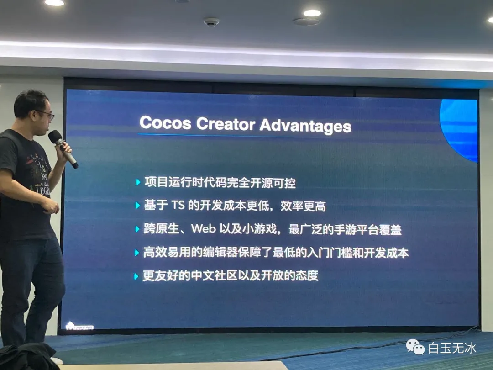
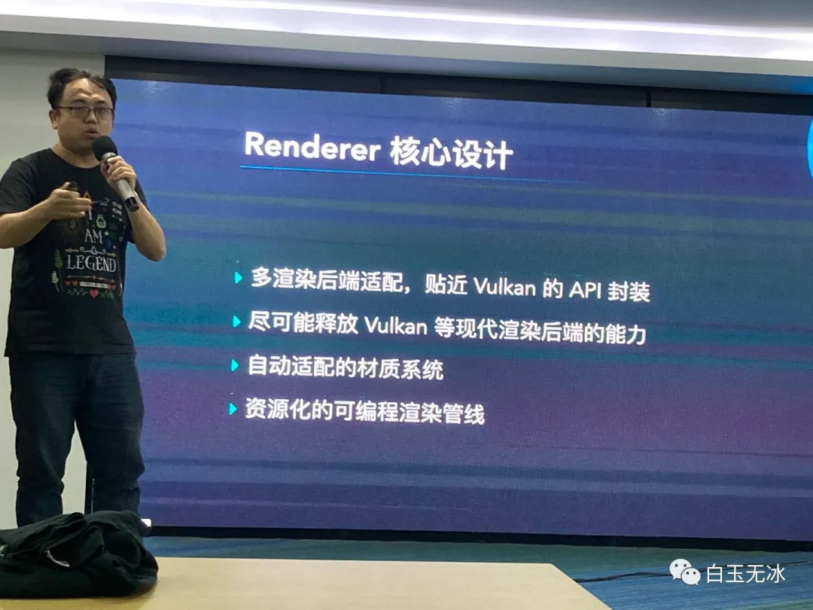
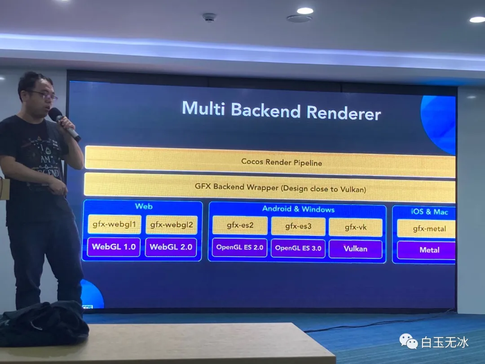
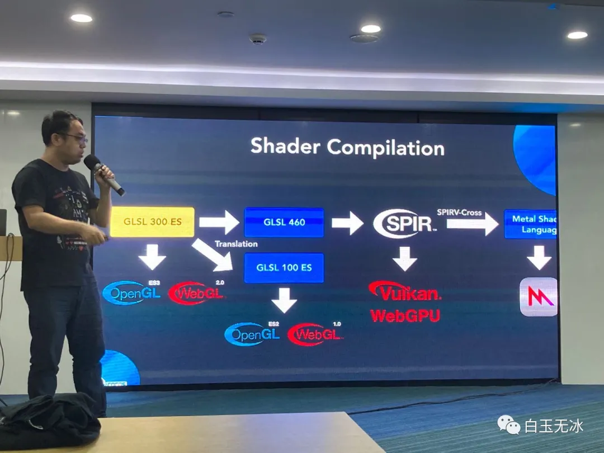
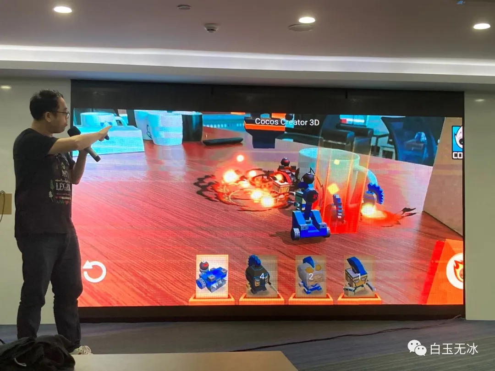

# Cocos Creator 引擎规划路线前瞻
## Cocos 3D核心设计和路线图

* 引擎100%开源，开发者可以可以针对自己需求自定义引擎

* 新的多平台引擎架构

## 基于物理的渲染

### 基于物理的光源

* 根据现实中光源的各种属性来制作光源效果

### 基于物理的摄像机

* 按照现实中摄像机的参数来设置相机参数，并且设置可以保存，不会因为改一个摄像机导致其他摄像机渲染偏差

## Cocos Creator的优势

## Cocos Creator面向未来的渲染器设计

* 接口尽量贴近Vulkan设计

* 引擎兼容高级特性，Cocos Shader使用GLSL 300 ES规则，开发者只需要写这一种Shader，引擎会针对不同平台编译成各种版本来使用

* 水体效果

## Cocos AR

* 使用相机拍到的照片生成游戏地图，并在此之上进行游戏

* 使用可编程渲染管线渲染出的游戏画面

