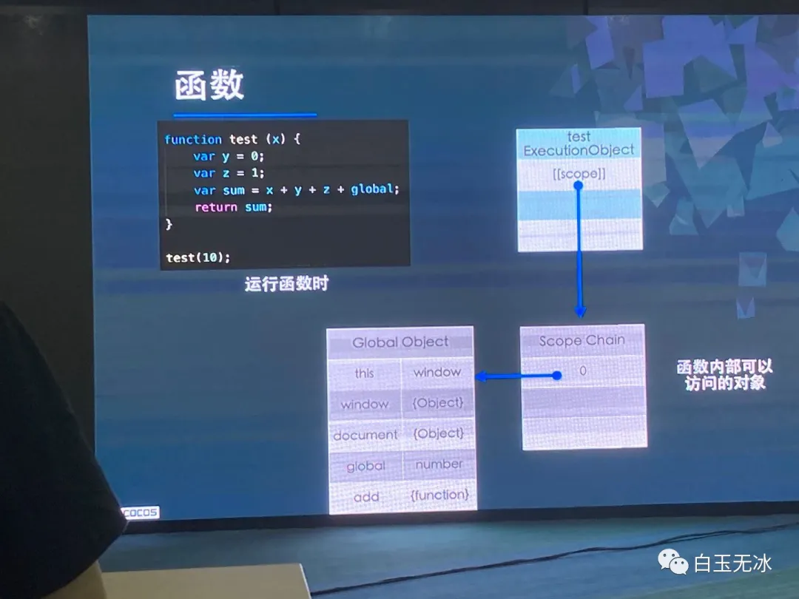
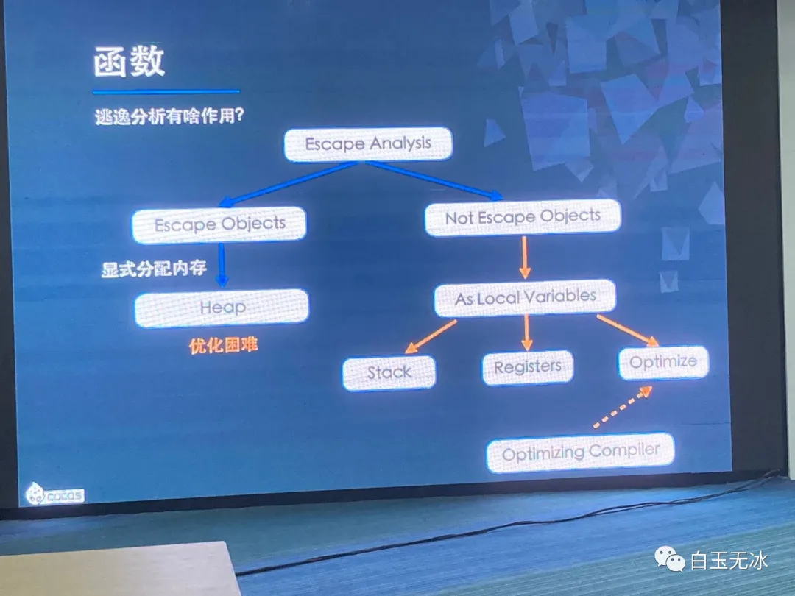

# 《V8与JS引擎浅析》 赵铮雄 Cocos高级咨询顾问

## V8与JS引擎浅析

#### 从JS层进行优化

## JS Engine

### V8 JIT编译

 

* JIT编译过程

  

* 进行TurboFan优化的条件

* 优化回滚

* 需要尽量避免的情况

* 如何进行优化

### JSC JIT编译

* JSC JIT编译流程

* JSC JIT编译不同阶段性能

* JSC JIT编译的风险

### 隐藏类

  

* JS中类的属性会添加到键值对中，若动态添加属性则会创建新的Class键值对，导致后续读取属性数据时性能下降

### 内联缓存

  

* 读取对象属性时会增加一层访问，在频繁调用的计算中，使用局部变量记录对象的属性可以提升读取性能

  

### 垃圾回收

   

* 触发GC后会在Eden区寻找依然被引用的对象占用的内存，并将其复制到Suvivor1区，下次触发GC时如果依然被引用，则会复制到Survivor2区，并在1区和2区反复，在其存在时间太长，则会被复制到Old区

* 减少一直存在对象的数量

### 代码优化

#### 类型

 

#### 数组

 

* 数组在JS中也是用和隐藏类一样的方式

  

* 给数组添加数据时，若当前数组类型无法存储新添加的类型的数据，数组则会进行类型转换，如 `array = [1, 2, 3]` 类型为 `PACKED_SMI_ELEMENTS` 小整数类型，若添加了一个数据 `4.56` 数组类型则会转变为 `PACKED_DOUBLE_ELEMENTS` 浮点数类型，若再添加一个 `'x'` 数组类型又会进行转变，且转换是不可逆的。

* 数组中有空位的时候，同样也会转换类型

 

* 上面两组代码中，左边的代码因为使用了 `<=` 让数组下标越界了，会增加许多额外的性能损耗

* -0也会导致数组类型转变为浮点数类型，所以要特别注意

#### 函数

           

